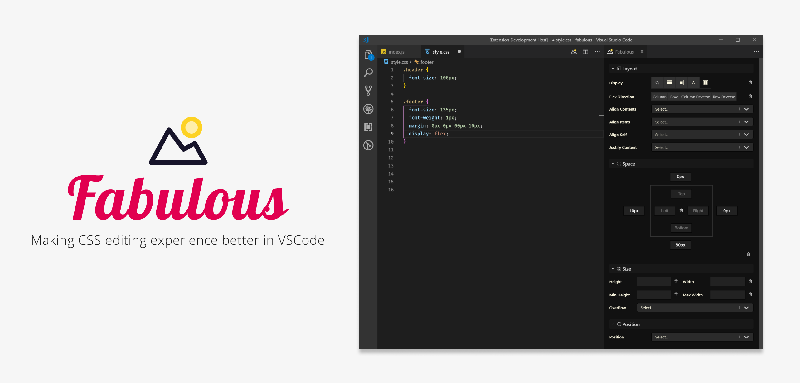

 

 

Fabulous introduces a CSS properties side-bar into Visual Studio Code. Fabulous supports editing **CSS** files and **styled-components**.

### Getting started

- Install the "Fabulous" extension in VS Code
- After opening a `css`, `js`, `jsx` or `tsx` file, click on the  icon to toggle the side-bar
- Place your cursor in a CSS rule or in a Styled component template literal
- You should see the sidebar controls become active

### Help us make Fabulous better

Have a look at our [contribution guide](./contributing.md).
